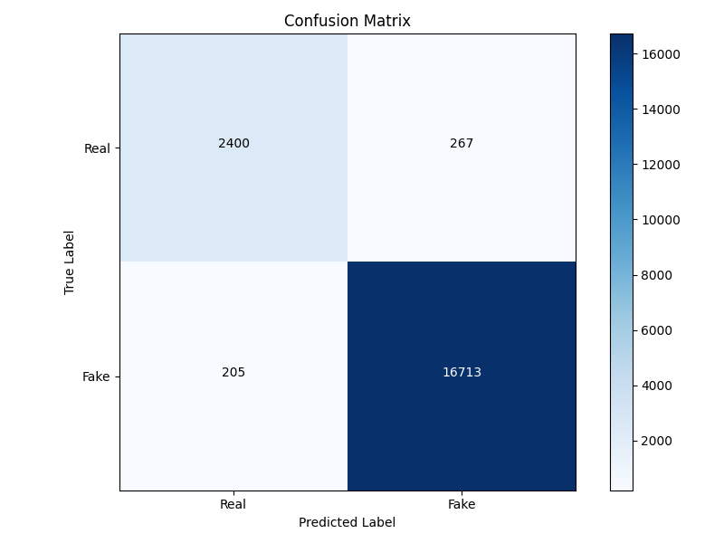
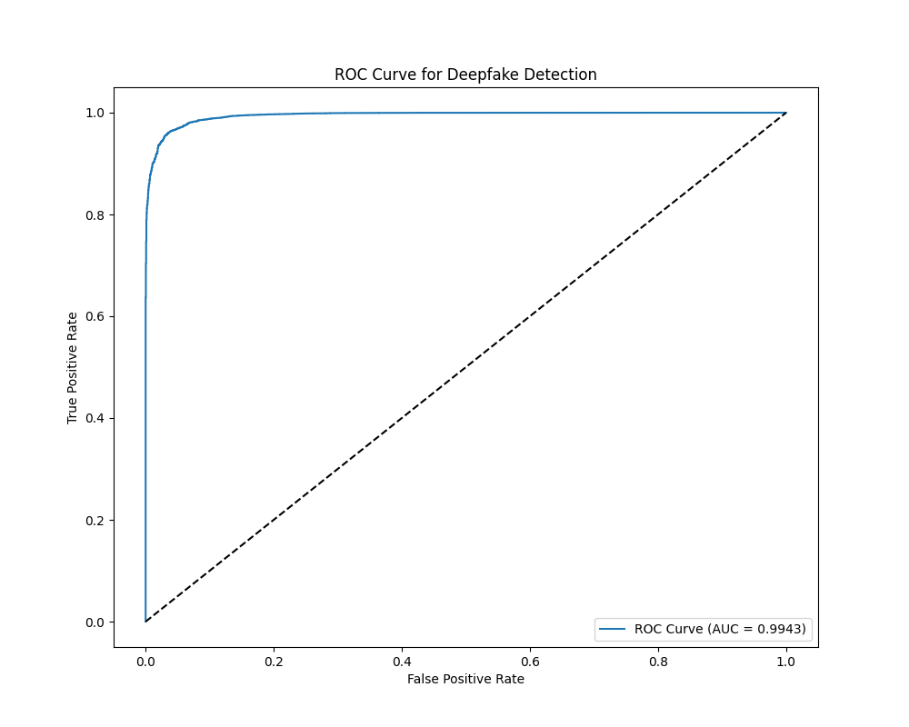
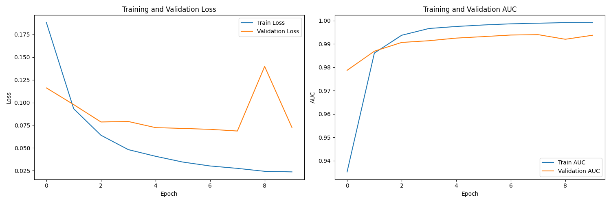

# Deepfake Detection using Vision Transformers (ViT)

This project presents a deep learning-based approach for detecting deepfake videos using Vision Transformers. The model is trained and evaluated on the **Celeb-DF-v2** dataset and achieves **state-of-the-art performance** through advanced training strategies and transformer-based feature extraction.

## 📌 Project Highlights

- **Architecture**: Vision Transformer (ViT-B/16)
- **Dataset**: Celeb-DF-v2 (Balanced real/fake frames)
- **Accuracy**: 97.59%
- **AUC**: 0.9943
- **Key Features**: Differential learning rates, data augmentation, transfer learning

---

## 📁 Dataset

**Celeb-DF-v2**

- 590 real videos (from 59 celebrities)
- 5,639 deepfake videos
- Extracted ~200 frames per video
- Post-processing:
  - Class balancing
  - ImageNet normalization
  - 224×224 RGB frame resizing

---

## 🧠 Model Architecture

- **Base**: Vision Transformer ViT-B/16 (pretrained on ImageNet)
- **Modifications**:
  - Replaced final head with single-neuron sigmoid classifier
  - Fine-tuned with differential learning rates

> 🔍 ViT excels at capturing **global context** and **spatial inconsistencies**—ideal for subtle deepfake detection.

---

## ⚙️ Training Strategy

- **Loss**: Binary Cross-Entropy with Logits
- **Optimizer**: AdamW with weight decay
- **Learning Rates**:
  - Backbone: 2e-5
  - Classification Head: 2e-4
- **Scheduler**: ReduceLROnPlateau
- **Early Stopping**: Based on validation AUC
- **Batch Size**: 32
- **Epochs**: 10

---

## 📊 Results

| Metric     | Validation | Test     |
|------------|------------|----------|
| Accuracy   | 97.55%     | 97.59%   |
| AUC        | 0.9991     | 0.9943   |
| Precision  | 0.9808     | 0.9843   |
| EER        | 0.040      | 0.038    |

### ✅ Confusion Matrix

- **True Positives (Fake detected as Fake)**: 16,713  
- **True Negatives (Real detected as Real)**: 2,400  
- **False Positives**: 267  
- **False Negatives**: 205  

### 📈 ROC Curve

- **AUC = 0.9943**
- Indicates excellent model discrimination ability

### 📉 Training History

- Shows smooth convergence and generalization
- Slight validation fluctuations handled via early stopping and scheduling

---

## 🚀 Key Advantages

- **High Performance**: Near-perfect AUC
- **Balanced Dataset Handling**: Augmented and proportionally split
- **Explainable**: Attention mechanisms in ViT offer visual interpretability
- **Transfer Learning**: Efficient fine-tuning with minimal overfitting

---

## 🔮 Future Work

- Incorporate **temporal modeling** using LSTMs or 3D Transformers
- Explore **larger ViT models** (e.g., ViT-L/16)
- Combine **frequency domain analysis** and **facial landmark attention**
- Use **ensemble techniques** for robustness

---

## 📚 References

- Dosovitskiy et al. *An Image is Worth 16x16 Words*
- Li et al. *Celeb-DF: A Challenging DeepFake Dataset*
- Kingma & Ba. *Adam Optimizer*
- Loshchilov & Hutter. *AdamW Regularization*

---

## 👥 Authors

- Adithya MS (CS22B1098)  
- Vignesh Aravindh B (CS22B2004)  
- Ashiq Irfan (CS22B2021)  
**IIITDM Kancheepuram**  
**May 2025**
